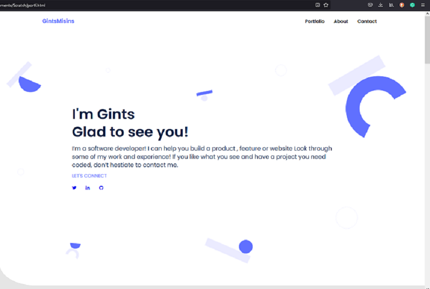
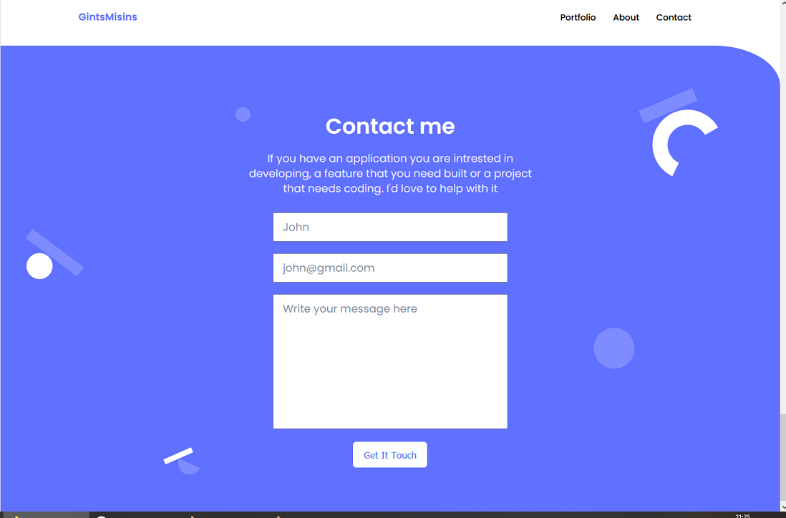
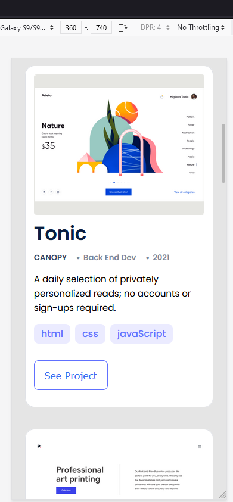
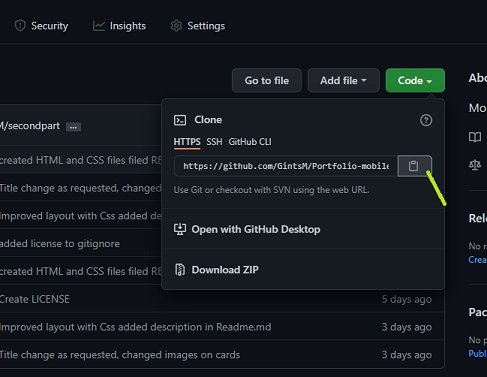

# Portfolio-mobile-version
Mobile and Desktop version
    

     
    

        

     
    

        

     
    

## Build with   
   * HTML
   * CSS

### Getting Started
* Prerequisites Create an account on github
Install gitbash or use git on the command line.

Use an IDE of your preference such as VScode.

Steps to you should copie the link (marked with a green line)
    

        

     
    

Clone the repository to your locaL machine. Enter your github credentials if prompted.

Open the index.html file with the browser of your preference.

### Live

you can see it here https://gintsm.github.io/Portfolio-mobile-version/

### 👤 Author1
    * Github: GintsM 
    * Twitter: GintsMisins

### 👤 Author2
    * Github : Meri-MG 

### Show your support
Give a ⭐️ if you like this project!
### 📝 License
This project is MIT licensed.
