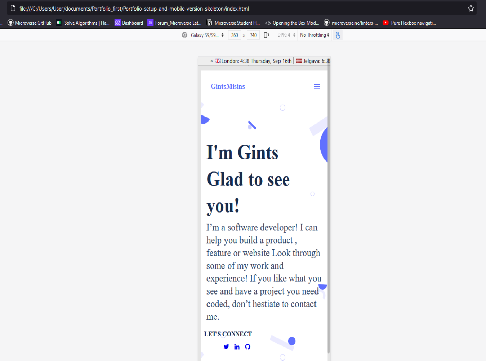
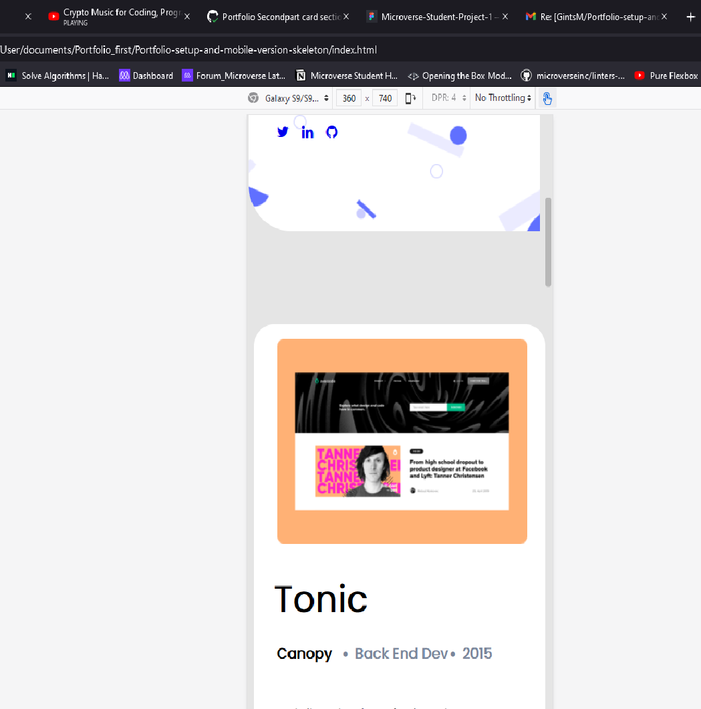
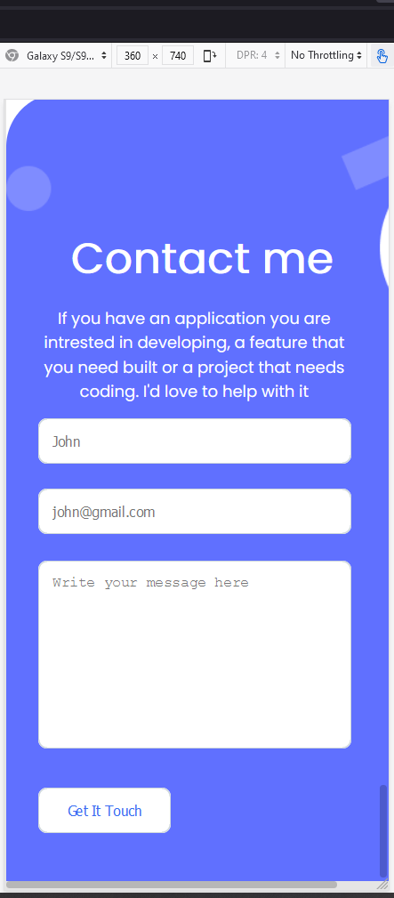

# Portfolio-mobile-version
Mobile version
    

     
    

        

     
    

        

     
    

## Build with   
   * HTML
   * CSS

## Live Demo
To see the live Demo of the project click [here](https://github.com/GintsM/Portfolio-mobile-version/)

### Getting Started
* Prerequisites Create an account on github
Install gitbash or use git on the command line.

Use an IDE of your preference such as VScode.

Steps to you should copie the link (marked with a green line)
    

        

     
    

Clone the repository to your locaL machine. Enter your github credentials if prompted.

Open the index.html file with the browser of your preference.

### 👤 Author1
    * Github: @GintsM 
    * Twitter: @GintsMisins

### 👤 Author2
    * Github: @Meri-MG 
    * Linkedin: Meri 
### Show your support
Give a ⭐️ if you like this project!
### 📝 License
This project is MIT licensed.